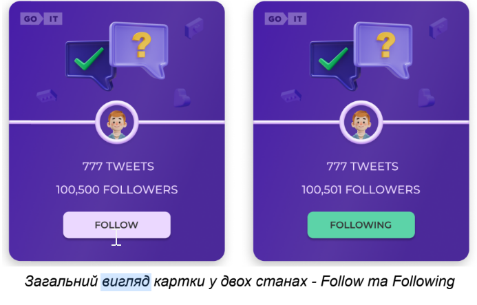
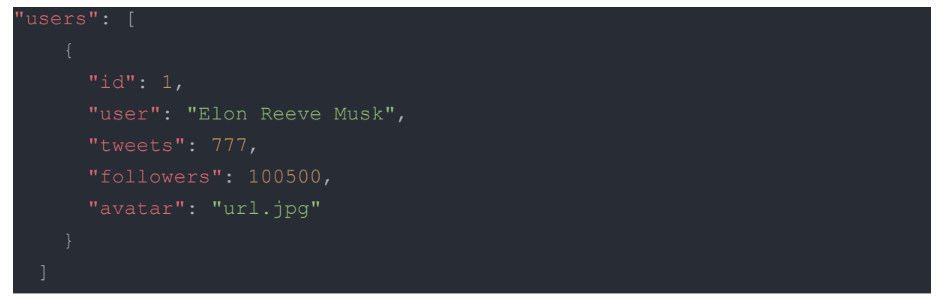

# test_task

## Тестове завдання

Мета: створити картки твітів та додати інтерактивності при клікові на кнопку.



## Критерії виконання

1. Верстка фіксована в рх, семантична та валідна.
2. Немає помилок в консолі браузера.
3. Робота виконана на нативному JS з використанням зборщиків або на React.
4. Інтерактивність працює відповідно до технічного завдання.
5. Код відформатований та без коментарів.
6. В репозиторії має бути описаний README.md.

Технічне завдання

1. Відповідно до макету потрібно реалізувати картки юзера.
2. При клікові на кнопку Follow - текст змінюється на Following. Також
   змінюється колір кнопки. А до кількості фоловерів додається і ваш. Тобто,

початкова кількість складає 100,500 фоловерів. При клікові на кнопку буде
100,501. 3. При оновлені сторінки має фіксуватись кінцевий результат дій юзера.
Тобто, якщо клікнути по кнопці і оновити сторінку - то кнопка все рівно
залишається в стані Following із відповідним кольором, а кількість фоловерів НЕ
зменшується до початкового значення. 4. При повторному клікові на кнопку її
текст та колір змінюються до початкового стану. Також змінюється і кількість
фоловерів. Вона зменшується на 1 (100,500). 5. В коді цифра 100,500 має бути
прописана одним значенням (100500). В UI - виведено через кому (100,500).

Створи свій персональний бекенд для розробки за допомогою UI-сервісу mockapi.io.
Створи ресурс users. Використай конструктор ресурсу та опиши об'єкт юзера, як
описано вище.

Юзер

1. Створюєте локальну базу даних (окремий файл json) з наступними полями: id,
   user, tweets, followers, avatar (див код нижче).
2. Зображення аватарів мають бути прописані окремими url у властивості “avatar”.
   Можете підібрати їх самостійно.
3. Має бути від 30 юзерів з різними даними (на ваш розсуд) в базі. Зроби
   пагінацію. На одній сторінці пагінації має відображатися від 8 до 12 твітів,
   решта підгружатись при натисканні Load More
4. Відповідно до бази потрібно згенерувати відповідну кількість карток на
   фронт-частині застосунку.
5. Кожна картка має бути незалежною функціонально одна від одної.
6. Решта вимог аналогічні до вищеописаного технічного завдання.



Макет:
https://www.figma.com/file/zun1oP6NmS2Lmgbcj6e1IG/Test?node-id=0%3A1&t=VoiY
TfiXggVItgVd-1

Додаткове завдання За виконання вам будуть нараховані додаткові бали! Без
виконання додаткового завдання ви не зможете отримати максимальний бал.

Створи маршрутизацію, використовуючи React Router. У застосунку повинні бути
такі маршрути. Якщо користувач зайшов за неіснуючим маршрутом, його необхідно
перенаправляти на домашню сторінку. '/' – компонент Home, домашня сторінка.
Стилізація та оформлення на ваш розсуд '/tweets’ - компонент tweets, сторінка із
відображенням твітів На сторінці tweets має бути кнопка Back, яка веде на
головну сторінку.

Завдання із зірочкою\* Додай фільтрацію. Це має бути Dropdown із 3
опціями(оформлення на ваш розсуд): show all, follow, followings show all -
показати всі твіти. follow - показати твіти, у яких стан follow. followings -
показати твіти, у яких стан following

Подальші дії

1. Роботу заливаєте на github pages або netlify.com.
2. Виконане тестове завдання надсилайте через форму
   https://forms.gle/pqTovc83TJ5qSFKf9
3. Очікуйте на фідбек.

Используй этот репозиторий организации GoIT как шаблон для создания репозитория
своего проекта. Для этого нажми на кнопку `«Use this template»` и выбери опцию
`«Create a new repository»`, как показано на изображении.


## Подготовка к работе

1. Убедись что на компьютере установлена LTS-версия Node.js.
   [Скачай и установи](https://nodejs.org/en/) её если необходимо.
2. Установи базовые зависимости проекта командой `npm install`.
3. Запусти режим разработки, выполнив команду `npm start`.
4. Перейди в браузере по адресу [http://localhost:3000](http://localhost:3000).
   Эта страница будет автоматически перезагружаться после сохранения изменений в
   файлах проекта.

## Деплой

Продакшн версия проекта будет автоматически проходить линтинг, собираться и
деплоиться на GitHub Pages, в ветку `gh-pages`, каждый раз когда обновляется
ветка `main`. Например, после прямого пуша или принятого пул-реквеста. Для этого
необходимо в файле `package.json` отредактировать поле `homepage`, заменив
`your_username` и `your_repo_name` на свои, и отправить изменения на GitHub.

```json
"homepage": "https://your_username.github.io/your_repo_name/"
```

Далее необходимо зайти в настройки GitHub-репозитория (`Settings` > `Pages`) и
выставить раздачу продакшн версии файлов из папки `/root` ветки `gh-pages`, если
это небыло сделано автоматически.


### Статус деплоя

Статус деплоя крайнего коммита отображается иконкой возле его идентификатора.

- **Желтый цвет** - выполняется сборка и деплой проекта.
- **Зеленый цвет** - деплой завершился успешно.
- **Красный цвет** - во время линтинга, сборки или деплоя произошла ошибка.

Более детальную информацию о статусе можно посмотреть кликнув по иконке, и в
выпадающем окне перейти по ссылке `Details`.


### Живая страница

Через какое-то время, обычно пару минут, живую страницу можно будет посмотреть
по адресу указанному в отредактированном свойстве `homepage`. Например, вот
ссылка на живую версию для этого репозитория
[https://goitacademy.github.io/react-homework-template](https://goitacademy.github.io/react-homework-template).

Если открывается пустая страница, убедись что во вкладке `Console` нет ошибок
связанных с неправильными путями к CSS и JS файлам проекта (**404**). Скорее
всего у тебя неправильное значение свойства `homepage` в файле `package.json`.

### Маршрутизация

Если приложение использует библиотеку `react-router-dom` для маршрутизации,
необходимо дополнительно настроить компонент `<BrowserRouter>`, передав в пропе
`basename` точное название твоего репозитория. Слеш в начале строки обязателен.

```jsx
<BrowserRouter basename="/your_repo_name">
  <App />
</BrowserRouter>
```

## Как это работает


1. После каждого пуша в ветку `main` GitHub-репозитория, запускается специальный
   скрипт (GitHub Action) из файла `.github/workflows/deploy.yml`.
2. Все файлы репозитория копируются на сервер, где проект инициализируется и
   проходит линтинг и сборку перед деплоем.
3. Если все шаги прошли успешно, собранная продакшн версия файлов проекта
   отправляется в ветку `gh-pages`. В противном случае, в логе выполнения
   скрипта будет указано в чем проблема.
